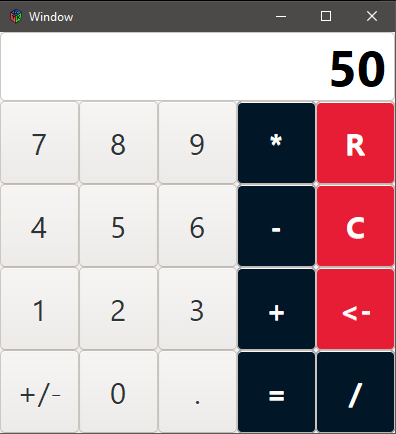

# gtk-calculator
 A simple calculator made in GTK+ 3.0 C

Requirements to build on windows :
	- MSYS2 
	- Mingw64-GTK3
	
Run "./build.script" to build
Run "./run.script" to run 

DLL dependencies are included in "build" dir to run the application with MSYS2.